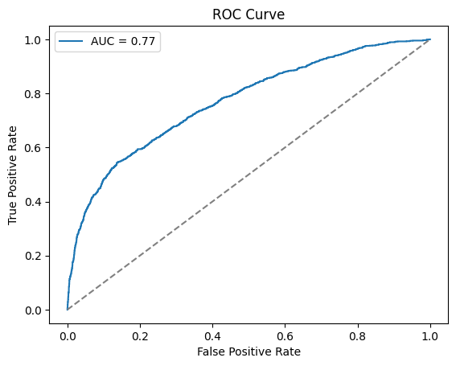
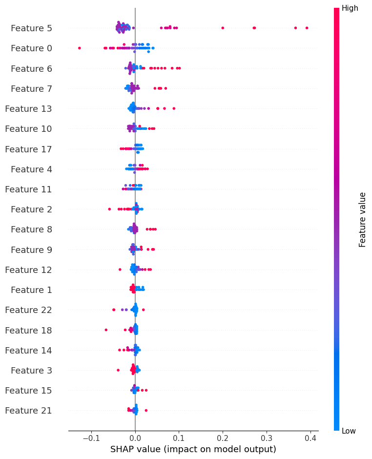

# Predicting Credit Card Default to Mitigate Financial Risk 💳

This repository contains the code and resources for a deep learning project aimed at predicting credit card payment defaults. The model analyzes historical customer data to forecast the probability of default in the next month, enabling financial institutions to manage risk proactively.

## 🎯 Problem Statement
Financial institutions face the risk of loan defaults when customers are unable to repay their credit card debt. This leads to heavy financial losses and affects banking stability. This project aims to use Deep Learning to predict whether a customer is likely to default on their payments in the next month.

## 💼 Business Objective
Early detection of potential defaulters enables banks and financial institutions to take proactive measures, such as:
* Offering flexible and personalized repayment plans 📝
* Adjusting credit limits to prevent further debt accumulation 💰
* Providing timely financial counseling and support 📊

## 📊 Dataset
The project utilizes the **UCI Credit Card Dataset**.
* It contains **30,000 customer records** with **25 features**.
* Features include customer demographics, credit limit, historical payment status, bill amounts, and payment amounts.
* Exploratory data analysis confirmed the dataset is clean with **no missing values**.

## ⚙️ Tech Stack & Libraries
This project is built using Python and leverages the following libraries:
* **Data Manipulation & Analysis**: Pandas, NumPy
* **Machine Learning & Preprocessing**: Scikit-learn
* **Deep Learning**: TensorFlow, Keras
* **Hyperparameter Tuning**: KerasTuner
* **Model Explainability**: SHAP
* **Data Visualization**: Matplotlib
* **Model Saving**: joblib

## 🛠️ Project Workflow
The project follows a structured machine learning pipeline:
1.  **Data Loading and EDA**: The dataset was loaded and analyzed to understand its structure and confirm data quality.
2.  **Preprocessing**: Features were separated from the target variable. The data was split into an 80/20 training-testing set using a **stratified split** to handle the imbalanced nature of the target class. All features were then normalized using Scikit-learn's **StandardScaler**.
3.  **Model Building**: A Sequential Neural Network was constructed using Keras with Dense layers, `ReLU` activation, and **Dropout layers** for regularization to prevent overfitting. The final layer uses a `sigmoid` activation for binary classification.
4.  **Initial Training & Evaluation**: The baseline model was trained for 20 epochs and evaluated on the test set.
5.  **Hyperparameter Tuning**: **KerasTuner** was employed to systematically search for the best hyperparameters (e.g., number of layers, neurons per layer, learning rate) to optimize model performance based on the `val_auc` metric.
6.  **Final Model Training**: The best model identified by KerasTuner was trained for 20 epochs.
7.  **Explainability**: **SHAP (SHapley Additive exPlanations)** was used to interpret the final model's predictions, identifying which features were the most influential drivers of default risk.
8.  **Model Versioning**: The final trained model (`.keras`), the scaler object (`.pkl`), and the list of features (`.json`) were saved as artifacts for reproducibility and potential deployment.

## 📈 Key Results & Findings
The final, tuned model achieved strong predictive performance on the unseen test data:
* **Test Accuracy**: **82.1%**
* **Test AUC**: **0.769**
* **Model Explainability**: The SHAP summary plot provided clear insights into the model's decision-making process, highlighting the importance of features like payment history (`PAY_0`) in predicting default.

_Caption: The ROC curve illustrates the model's ability to distinguish between classes, achieving an AUC of 0.769._

_Caption: The SHAP summary plot ranks features by their impact on the model's predictions._

  **[📌View the Project on Kaggle](https://www.kaggle.com/code/bhalekarnandini/credit-card-default-prediction-using-deep-learning)**

